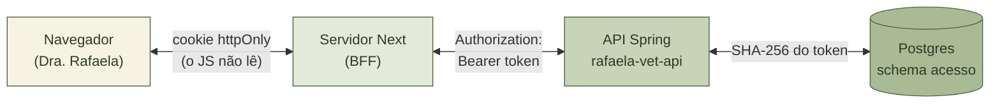
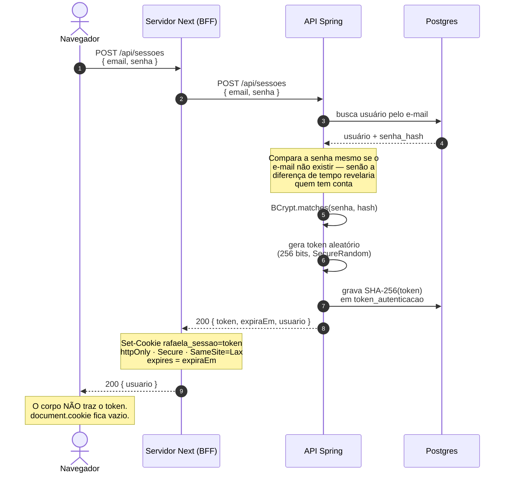
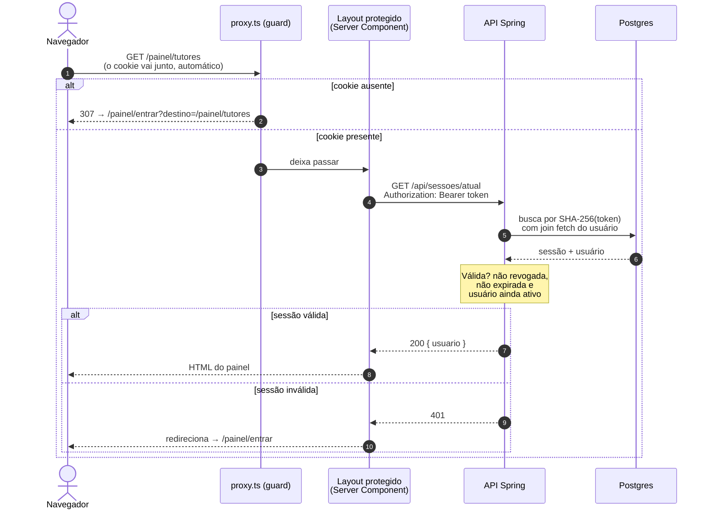
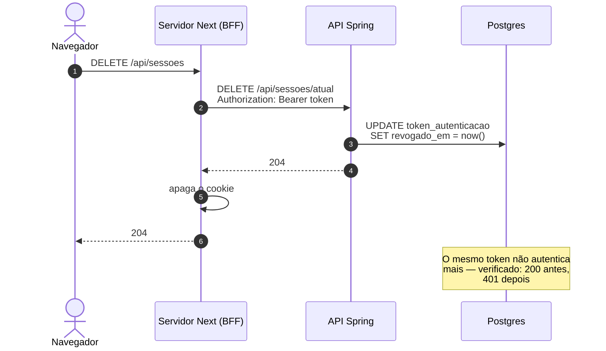
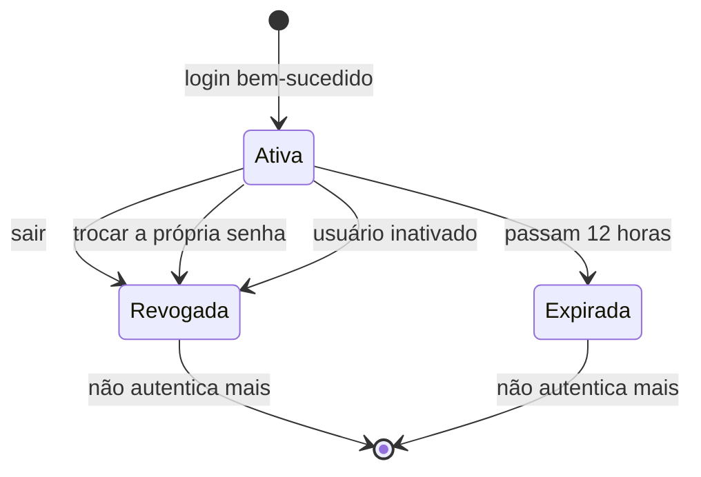
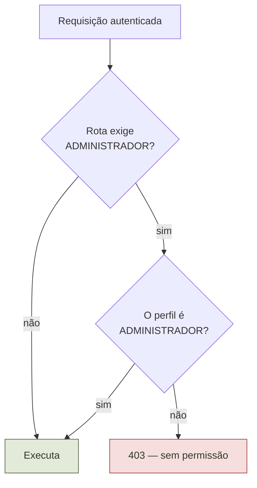

# Autenticação e sessão — como front e back conversam

Documento de referência do fluxo completo entre **`rafaela-vet-front`**
(Next.js) e **`rafaela-vet-api`** (Spring Boot): como alguém entra, como cada
requisição é autenticada, como a sessão morre e o que garante cada parte.

> Este é o documento canônico do assunto. O `CLAUDE.md` de cada repositório
> resume as regras; os detalhes e os diagramas ficam aqui.

---

## As três decisões que explicam todo o resto

**1. A autenticação é nossa, no Spring** — não Clerk, Auth0 ou Keycloak.
São 1–3 usuários, **sem cadastro público** (quem cria usuário é o
administrador), e a identidade fica no mesmo Postgres do prontuário, o que
simplifica a LGPD. Um provedor externo cobraria mensalidade para resolver
problemas que não temos.

**2. O token é opaco e vive no banco** — não é JWT. A vantagem do JWT é ser
*stateless*, o que só importa em escala; com três usuários, uma consulta por
requisição é irrelevante. Em troca ganhamos **revogação imediata**: sair
invalida de verdade, e inativar alguém derruba as sessões na hora. Com JWT
puro o token continuaria válido até expirar.

**3. O navegador nunca vê o token** — padrão BFF. O token vive num cookie
`httpOnly`, e quem fala com a API é o **servidor** do Next. Como o sistema
guarda prontuário e CPF, um token em `localStorage` seria lido por qualquer
XSS. Aqui não há o que roubar.

---

## Quem é quem

O ponto que costuma confundir: **o navegador nunca fala com a API Spring**.
Ele só conversa com o servidor do Next, que age como intermediário de
confiança. Por isso não existe configuração de CORS no projeto — não há
requisição de origem cruzada.

---

## Fluxo 1 — Entrar

**O que o usuário recebe:** apenas os dados dele. O token fica no cookie, que
o JavaScript da página não consegue ler.

**Falha de credencial** devolve sempre `401` com a mesma mensagem — *"E-mail
ou senha inválidos"* — seja e-mail inexistente, senha errada ou usuário
inativo. Diferenciar permitiria descobrir quem tem conta no sistema.

---

## Fluxo 2 — Uma requisição autenticada

### Duas barreiras, com papéis diferentes

| | `proxy.ts` (guard) | Layout protegido |
|---|---|---|
| O que faz | vê se o cookie **existe** | pergunta à API se o token **vale** |
| Custo | nenhum | uma chamada HTTP |
| Vale como segurança? | **Não** | Sim |
| Para que serve | evitar piscar tela vazia | validação real |

> ⚠️ **O guard não é segurança.** Um cookie forjado passa por ele — e morre no
> layout, com 401. A autorização real é sempre da API, a cada requisição.
> Nunca trate a checagem do frontend como proteção.

---

## Fluxo 3 — Sair

Se a chamada à API falhar, o cookie é apagado assim mesmo: é melhor a pessoa
sair da tela e o token expirar sozinho do que continuar aparentemente logada.

---

## Ciclo de vida da sessão

**Três caminhos derrubam a sessão antes da hora**, e cada um por um motivo:

- **Sair** — o óbvio.
- **Trocar a senha** — derruba **todas** as sessões, inclusive a atual. Quem
  troca a senha por desconfiar de invasão não ganharia nada se a sessão do
  invasor continuasse aberta.
- **Inativar o usuário** — o acesso tem que cair na hora, não quando o token
  expirar.

A validade padrão é **12 horas** (`app.sessao.validade`), pensada para cobrir
um dia de trabalho sem exigir login a cada intervalo.

---

## Autorização: quem pode o quê

Autenticado ≠ autorizado. Depois de saber *quem é*, a API decide *o que pode*.

| Rota | Quem pode |
|---|---|
| `POST /api/sessoes` | **público** — é o único jeito de obter um token |
| `/api/usuarios/**` | apenas `ADMINISTRADOR` |
| `PATCH /api/usuarios/atual/senha` | qualquer autenticado, **sobre a própria conta** |
| `GET /actuator/health` | público |
| todo o resto | qualquer autenticado |

A anotação `@PreAuthorize("hasRole('ADMINISTRADOR')")` fica **na classe**
`UsuarioController`, e não em cada método — assim um endpoint novo já nasce
protegido, em vez de depender de alguém lembrar de anotá-lo.

---

## Onde cada peça mora

### Frontend (`rafaela-vet-front`)

| Arquivo | Papel |
|---|---|
| `proxy.ts` | guard barato de `/painel/*` |
| `lib/sessao.ts` | nome do cookie, rotas, `destinoSeguro()` |
| `lib/api.ts` | cliente HTTP — **só servidor**; anexa o `Bearer` |
| `lib/acesso.ts` | funções tipadas do domínio |
| `app/api/sessoes/route.ts` | **o BFF** — grava e apaga o cookie |
| `app/painel/entrar/login-form.tsx` | formulário |
| `app/painel/(protegido)/layout.tsx` | valida a sessão de verdade |

### Backend (`rafaela-vet-api`)

| Arquivo | Papel |
|---|---|
| `config/SecurityConfig` | rotas públicas, filtro, `@EnableMethodSecurity` |
| `acesso/filter/TokenAutenticacaoFilter` | lê o `Bearer` e autentica a requisição |
| `acesso/service/TokenGenerator` | gera o token e calcula o SHA-256 |
| `acesso/service/CriarSessaoService` | login |
| `acesso/service/EncerrarSessaoService` | logout e revogação em massa |
| `acesso/entity/TokenAutenticacaoEntity` | a sessão; `estaValida()` |
| `V002__acesso_criar_token_autenticacao.sql` | a tabela |

---

## O que garante o quê

| Risco | O que impede |
|---|---|
| XSS roubar a sessão | cookie `httpOnly` — o JS não lê o token |
| Vazamento do banco virar acesso | guardamos **SHA-256** do token, não o token |
| Vazamento do banco virar senha | senha em **BCrypt** |
| Descobrir quem tem conta | mesma mensagem e mesmo tempo de resposta em toda falha |
| Token adivinhado | 256 bits de `SecureRandom` |
| Logout que não desloga | token opaco revogado no banco |
| Sessão sobreviver à troca de senha | troca revoga todas as sessões |
| Ex-funcionário com sessão aberta | inativar revoga na hora |
| Open redirect no login | `destinoSeguro()` só aceita caminhos de `/painel` |
| Sistema ficar sem administrador | não se inativa nem rebaixa o último |
| Stack trace vazar ao cliente | handler final devolve 500 genérico |
| Log forjado | `X-Request-Id` recebido é sanitizado |

### Por que SHA-256 no token e BCrypt na senha

Parece incoerente, mas resolve problemas diferentes:

- **Senha** é escolhida por humano, tem pouca entropia e é alvo de força
  bruta. BCrypt é **lento de propósito** e usa *salt* — o que o torna
  inviável como chave de busca.
- **Token** tem 256 bits aleatórios; força bruta é impraticável. O hash aqui
  serve para **procurar a linha no banco**, então precisa ser determinístico.
  SHA-256 resolve, e rápido.

---

## Erros e o que significam

| Código | Quando | O que o front faz |
|---|---|---|
| `400` | campo inválido | mostra erro por campo |
| `401` | credencial errada, token inválido ou expirado | manda para o login |
| `403` | autenticado, mas sem permissão | mostra "sem permissão" |
| `404` | recurso não existe | mostra "não encontrado" |
| `409` | conflito (e-mail já cadastrado) | mostra a mensagem |
| `422` | regra de negócio (último administrador) | mostra a mensagem |
| `500` | erro inesperado | mostra o `requestId` para suporte |

Toda resposta de erro traz um **`requestId`**, que é o mesmo id que marca as
linhas de log no backend. Com ele, `grep <id>` no log entrega o rastro
completo daquela requisição.

---

## O que **não** fazer

- **Não** importar `lib/api.ts` em componente `"use client"` — ele lê o
  cookie no servidor. Se importar, quebra (e é essa quebra que protege o
  padrão).
- **Não** devolver o token no corpo de nenhuma resposta ao navegador.
- **Não** tratar o `proxy.ts` como camada de segurança.
- **Não** anotar `TokenAutenticacaoFilter` com `@Transactional`: isso o faz
  ser proxiado com CGLIB, o proxy nasce sem chamar o construtor, o `logger`
  herdado de `GenericFilterBean` fica nulo e a aplicação **não sobe**. Por
  isso a consulta usa `join fetch`.
- **Não** criar endpoint público de cadastro — não existe auto-registro.
- **Não** ligar CSRF de volta sem antes rever o BFF: hoje o navegador não
  fala com a API direto, então não há credencial anexada automaticamente.
  Se isso mudar, o CSRF volta a ser necessário.

---

## Ainda não implementado

- **Limite de tentativas de login** (força bruta). O endpoint de login é o
  alvo óbvio, e hoje aceita tentativas ilimitadas.
- **Redefinição de senha pelo administrador**, para quando alguém esquecer a
  senha — hoje só existe a troca pelo próprio usuário, que exige a senha
  atual.
- **Limpeza de tokens expirados**: as linhas ficam no banco para sempre. Com
  três usuários demora a incomodar, mas é uma tarefa agendada a fazer.
